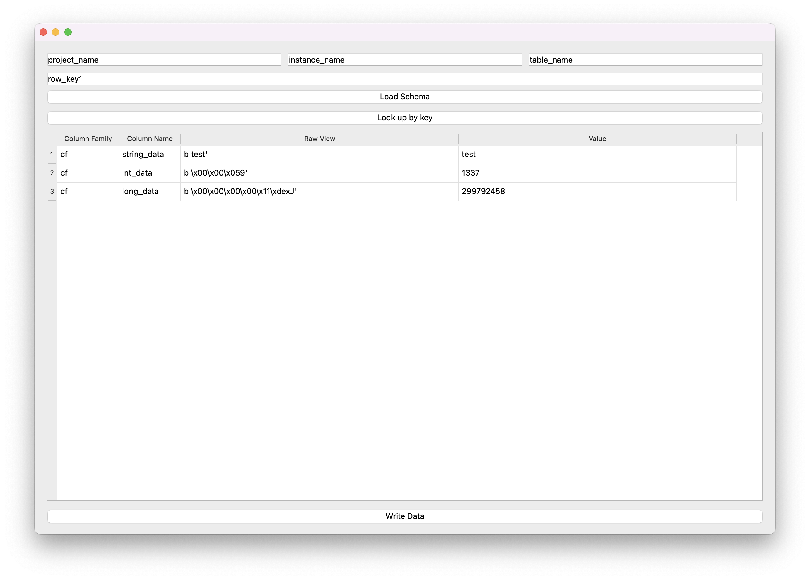

# Bigtable-front

## Motivation

The standard Google [cbt](https://cloud.google.com/bigtable/docs/cbt-overview) utility is not always convenient for
viewing and editing binary data. Unlike cbt, bigtable-front has a GUI written in PyQt. Plus, the application deals with
the YAML Schema that describes column families, possible columns, and how to treat the values.

## Installing Dependencies and Supported Versions

Supported Python version 3.6.1+

```console
$ python3 -m pip install -r requirements.txt
```

## How to Use
Assuming raw data
```console
row_key1
  cf:string_data
    "test"
  cf:int_data
    "\x00\x00\x059"
  cf:long_data
    "\x00\x00\x00\x00\x11\xdexJ"
```
The following YAML Schema should be created and set to the application:
```yaml
---

cf:
  string_data:
    type: String
  int_data:
    type: JavaInteger
  long_data:
    type: JavaLong
```
After loading the schema, the application looks up data by row_key and deserializes it according to the schema.
This way, new records can be created and existing records can be edited.

